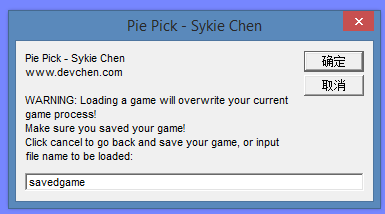

# 接馅饼
[](http://creativecommons.org/licenses/by-nc-sa/4.0/)

# 1 需求分析
## 1.1	功能需求
从屏幕上方水平随机位置匀速掉下箱子，箱子可能是蘑菇（占大约2/3），也可能是毒蘑菇（占大约1/3），如果是蘑菇，每过1.3s，则变为蘑菇，但一闪后又恢复为箱子，毒蘑菇也类似变化。屏幕下方有一个马里奥，随键盘操作横向运动，接到一个蘑菇则加10分，如果蘑菇未接到后落地则减10分（可出现负值）；接到毒蘑菇，马里奥死亡，扣100分，出现新的马里奥，最多有3条命。3条命用尽，则游戏结束。
### 1.1.1	箱子
主箱子的横坐标随机生成，两个箱子之前的间隔时间根据游戏难度随机在一定范围内确定。箱子的下落速度相同。
### 1.1.2	按钮
“Play” 按钮单击后开始游戏，并变为 “Pause” 按钮，单击之可以暂停游戏并再次变为“Play”。    
“Stop” 按钮单击后停止当前局的游戏，并将复位到游戏开始前的状态。    
“Exit” 按钮单击后退出程序。    
“Settings”按钮单击后可以设置游戏难度。    
“Load Score” 按钮单击后尝试从磁盘读取当前用户名以前的游戏记录，如果有超过当前最高分的记录则显示在主面板上的最高分中。    
“Save Score” 按钮只能在游戏停止时点击，单击后可以将刚才一局游戏的得分存盘到对应用户名的游戏记录中，便于以后读取。    
“Load Game” 按钮单击后可以从指定文件中读取以前保存的游戏状态，若当前游戏进行中则会提示是否放弃或先保存当前游戏。    
“Save Game” 按钮单击后可以将当前游戏状态保存。    
### 1.1.3	信息显示
窗口最上方为信息显示区，有五项内容，分别为用户名、本局剩余时间、本局得分、剩余生命数和历史最高分。  
一局游戏都没有进行过时，历史最高分不可用，显示为“N/A”。  
剩余时间和当前得分会在游戏中动态变化。  
### 1.1.4	游戏设置
单击设置按钮可以弹出游戏难度控制面板，不同级别蘑菇的出现频率不同，下落速度不同，显示为原形的时间不同。  
## 1.2 数据需求
输入数据：用户名、存盘文件名。    
从文件输入的数据：历史比分、游戏状态数据（用户名、剩余时间、比分、剩余生命、马里奥位置、小球位置、游戏难度等）。    
输出数据：用户名、本局剩余时间、本局得分、剩余生命数和历史最高分。
## 1.3 界面需求
如图所示：上方为信息显示区，显示用户名、本局剩余时间、本局得分、剩余生命数和历史最高分。  

## 1.4 开发与运行环境需求
Visual Studio 2015  
Windows XP 以上系统  
.NET Framework 4.0 以上  
C++ 运行库版本14以上  
屏幕分辨率800*600以上  
EasyX  2015-10-15 更新版
## 1.5 其他方面需求
由于会产生存档，故不能在只读存储设备，如光盘，上直接运行。
# 2 概要设计
## 2.1 主要数据结构
类：

## 2.2	程序总体结构
### 2.2.1 模块调用图

### 2.2.2 主程序流程图

## 2.3 子模块设计
小球类：  

小球节点类：  

小球链表类：

马里奥/碗类：

按钮类：

主窗口封装：

设置窗口类：

文字标签类：

全局函数：

# 3 详细设计
具体代码含义在源代码中有详尽的注释。
## 3.1 鼠标消息处理
循环检测鼠标消息：如果检测到按键，则将按键时指针位置分别传入几个按钮检测其是否在本按钮区域内。若是，则判断为按下了本按钮。

## 3.2 键盘消息处理
不应使用 getch 获取键盘消息，此函数只有在按下并弹起按键后才能触发。会造成响应延迟。键盘消息应检测按键按下状态。通过 `GetAsyncKeyState(VK_LEFT) & 0x8000` 完成按键按下状态的检测。

## 3.3 绘图时重叠对象的处理
对象重叠时，如果分别处理前后层对象，会导致擦除前层对象时将绘制好的后层对象也擦掉。妥善的处理方式是整体擦除后分别重绘。  
如游戏复位时：  
``` c++
boxes.clear();
repaintBlock(0, 0, 800, 530, &bg);
mario.reset(400);
frMain.setLife(3);
frMain.setTime(200);
frMain.setScore(0);
frMain.refreshLabels();
frMain.btPlay.show();
isPlaying = false;
gameOver = false;
ballBreak = 0;
```
# 4 测试
## 4.1	输入用户名
测试目的：检测用户名输入是否正常  
测试方法：输入空用户名，必须重新输入。输入带空格用户名，正常。输入超长用户名（30字符），会导致越界并退出游戏。  

## 4.2	开始/结束游戏
测试目的：测试游戏控制循环。  
测试方法：单击Play/Pause/Stop 按钮，游戏正常开始/暂停/重置，Play/Pause 按钮正常切换。  

## 4.3	难度设置
测试目的：测试弹出设置框及相关设置参数是否正常。  
测试方法：单击设置按钮，弹出设置框；单击其中选项，选项正常更新。回到游戏后难度发生相应变化。  

## 4.4	保存/读取最高分
测试目的：测试文件读写及比分读入/写入。  
测试方法：游戏状态单击保存比分，弹窗提示必须游戏结束后再保存；非游戏状态保存比分，正常。任意状态读入比分，当前用户保存过比分时正常读入并显示在最高分区域，当前用户未保存过时弹窗提示未找到历史比分数据。  

## 4.5	保存游戏存档
测试目的：测试文件读写及游戏当前状态保存。  
测试方法：非游戏中单击保存，提示必须先开始游戏。游戏中保存，提示输入存档文件名，并成功写入文件。用文本编辑器打开存档文件，各项数据正常。  
  
  

## 4.6	读取游戏存档
测试目的：测试文件读取及游戏状态控制。  
测试方法：单击读取存档按钮，弹窗警告读取存档会重置当前游戏，此时单击取消回到游戏。输入存档名并确定后，若存档存在，则提示正常读入，游戏暂停三秒后继续进行。若存档不存在，提示检查存档名是否正确。  
  
  

# 5 用户手册
## (1)	游戏介绍：
本程序是一个马里奥主题的接馅饼游戏；  
进入游戏后输入用户名进入主界面。此时单击开始游戏后屏幕顶端会随机掉落箱子。箱子内可能是蘑菇或毒蘑菇，用键盘左右键控制马里奥移动。箱子间隔一定时间会瞬间变化为蘑菇或毒蘑菇，并再次变回箱子。马里奥吃到蘑菇加十分，漏掉蘑菇扣十分，吃到毒蘑菇扣一百分并损失一条生命。共有三条生命，生命值用尽或游戏超过200秒时游戏结束。  
游戏结束后若当前比分高于信息区显示的最高分，最高分会更新。
## (2)	游戏控制：
游戏中单击暂停可以暂停游戏，此时暂停按钮变为开始按钮，单击其可以恢复游戏。  
单击设置按钮可以弹出难度设置框，共有三个难度，不同难度下箱子出现的频率、显示为原型的时间、以及下落的速度均有变化。  
游戏结束后单击保存分数可以将刚才一局游戏的分数写入当前用户对应的文件。  
单击读取分数可以在当前用户名保存过的分数中查找最高分并更新在信息区的最高分上。若保存的分数均没有当前分数高则会提示。  
游戏中单击保存游戏可以将当前游戏状态写入指定存档中。  
单击读取游戏可以读取以前保存的游戏状态。读取游戏会导致当前正在进行的游戏丢失，如有需要应先保存当前游戏。  
单击退出按钮退出游戏。
## (3)	系统环境要求：
运行于Windows XP 以上操作系统，并应安装有VC++ 2015 以上版本运行库；  
运行目录必须可写，不能在只读光盘上运行；屏幕分辨率 800*600 以上；  
.NET Framework 4.0 以上。
## (4)	安装方法：
拷贝主程序exe与资源文件到硬盘，双击exe即可启动；
## (5)	注意事项：
用户名为20字符以内的任意内容，但不能包含文件系统所不容许的字符，如 * 、 / 、 ? 等；

# 6 总结提高
## 6.1 课程设计总结
课程设计过程让我对大型程序的整体开发有了较好的把握。对于模块化设计和面向对象的封装编程有了更加深入的理解。Debug 的技术也得到了提高。  
更重要的是，在本次课设十分繁杂而令人摸不到头脑，又时时变动的需求压力下，对于工作生活中甲方变更需求有了更好的容忍度和应变力。

## 6.2 对本课程意见与建议
课程设计给出的需求和老师后来的要求有一些变动，必须更改已完成的设计。  
要求繁琐而不明确，让人无从下手。  
课程设计前基础知识讲授不足，绝大部分知识需要自学。

## 6.3附件：程序源代码
 


